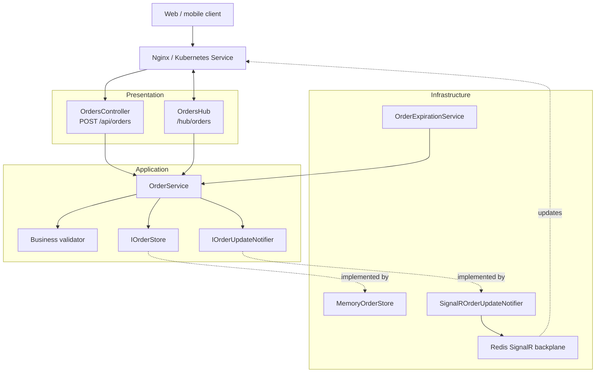
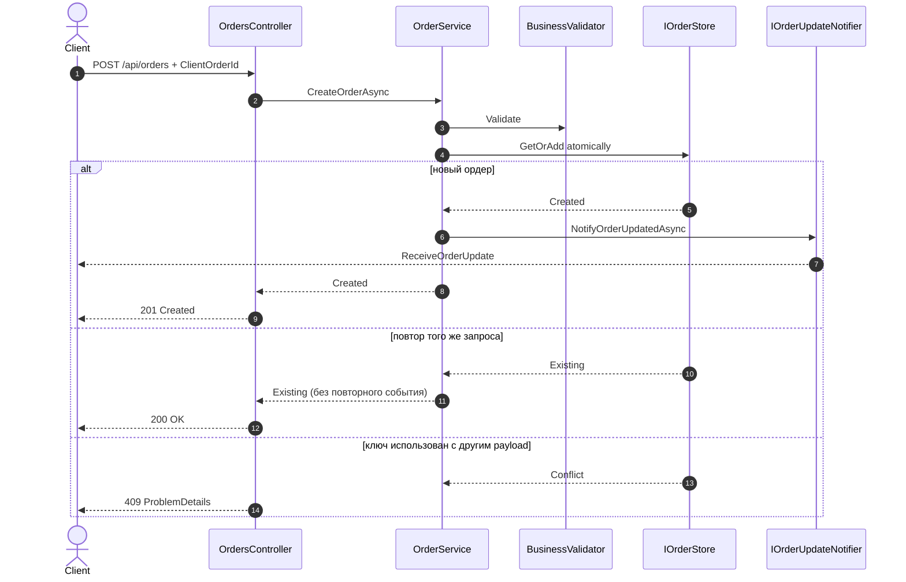

# Задание 2. Обновления ордеров через SignalR

## Архитектура



Создание и идемпотентный повтор показаны отдельно, чтобы компонентная схема не превращалась в паутину:



Аутентификация и `GlobalExceptionHandler` являются сквозными механизмами ASP.NET Core pipeline и намеренно не соединены стрелками с каждым компонентом.

Контроллер и Hub отвечают только за транспорт и идентификацию пользователя. Вся операция создания/отмены сосредоточена в `OrderService`, поэтому REST и background worker используют один сценарий. Store отвечает за конкурентное in-memory состояние, а typed SignalR group доставляет события всем соединениям владельца ордера.

Направление зависимостей соответствует Clean Architecture: use case зависит от абстракций `IOrderStore` и `IOrderUpdateNotifier`, но ничего не знает об ASP.NET Core, SignalR или `IMemoryCache`. Внешние механизмы подключаются адаптерами. Для масштаба тестового задания границы оставлены в одном проекте: это сохраняет архитектуру без лишних assembly и boilerplate (KISS).

## Состав решения

- `OrdersController` — принимает `POST /api/orders` и передает операцию сервису;
- `OrdersHub` — подключает все соединения пользователя к его SignalR-группе и отправляет начальный список;
- `OrderService` — создает и отменяет ордера, затем публикует typed SignalR events;
- `MemoryOrderStore` — хранит ордера в `IMemoryCache`, используя `ConcurrentDictionary` для конкурентного доступа;
- `SignalROrderUpdateNotifier` — реализует application port и изолирует сервис от SignalR;
- `GlobalExceptionHandler` — централизованно формирует безопасный `ProblemDetails` и пишет структурированный лог;
- `OrderExpirationService` — периодически находит просроченные ордера и отменяет их;
- `wwwroot/index.html` — минимальная страница ручной проверки.

## Основные решения

### Пользователь определяется сервером

`UserId` не принимается в `CreateOrderRequest`. REST endpoint и SignalR Hub получают один и тот же `ClaimTypes.NameIdentifier` из аутентифицированного пользователя. Поэтому клиент не может указать владельца ордера в payload.

В примере используется демонстрационная authentication scheme по `X-User-Id` для REST и `?userId=` для WebSocket handshake. Это позволяет запустить пример без Identity Provider. В production она заменяется на JWT Bearer; контроллер, Hub и сервисы при этом не меняются.

По той же причине demo использует ephemeral Data Protection provider и консольное логирование. Это исключает зависимость примера от пользовательского Windows keyring. В production ключи Data Protection должны быть постоянными и общими для всех экземпляров приложения.

### Typed Hub

```csharp
public interface IOrderClient
{
    Task ReceiveOrderUpdate(OrderResponse order);
    Task ReceiveInitialOrders(IReadOnlyCollection<OrderResponse> orders);
}

public sealed class OrdersHub : Hub<IOrderClient>
```

Typed Hub дает compile-time проверку имен и аргументов клиентских методов. Строковые вызовы вида `SendAsync("ReceiveOrderUpdate", ...)` не используются.

### Идемпотентность

Клиент передает стабильный `ClientOrderId`. Store атомарно выполняет `GetOrAdd` по ключу `(UserId, ClientOrderId)`. Поэтому параллельные или повторные HTTP-запросы создают ровно один ордер:

- первый запрос получает `201 Created` и инициирует одно SignalR-событие;
- retry получает `200 OK` с тем же `Order.Id`;
- повторное событие не отправляется;
- конкурентная отмена также выполняется один раз через `Interlocked.Exchange`.

Для одного процесса гарантию обеспечивает `ConcurrentDictionary`. В production окончательная гарантия переносится в БД через уникальный индекс `(UserId, ClientOrderId)`, а надежная публикация события — в Transactional Outbox.

### SOLID, DRY и обработка ошибок

- **SRP:** controller отвечает за HTTP, service — за use case, store — за состояние, notifier — за доставку, worker — за расписание.
- **DIP:** `OrderService` зависит только от `IOrderStore` и `IOrderUpdateNotifier`.
- **DRY:** REST и background worker используют один `OrderService`; логика отмены и рассылки не дублируется.
- **KISS:** Redis используется только там, где он действительно нужен для межинстансной SignalR-доставки; бизнес-код не связан с конкретной инфраструктурой.
- **Ошибки:** единый `IExceptionHandler` возвращает `ProblemDetails` с `traceId`; технические детали остаются в структурированных логах.

### Высокая нагрузка и горизонтальное масштабирование

Локальный Compose запускает два API-инстанса, Redis и Nginx. Redis backplane распространяет SignalR-сообщения между соединениями на разных инстансах. Для production приведен Kubernetes-манифест:

- Deployment стартует с `replicas: 2`;
- HPA увеличивает количество pod по одному при CPU выше 70%, максимум до 6;
- после снижения нагрузки scale-down стабилизируется 5 минут и уменьшает количество до `minReplicas: 1`;
- readiness/liveness probes исключают нездоровые pod из балансировки;
- resource requests/limits дают HPA корректную базу для расчета.

Важно: `MemoryOrderStore` оставлен по прямому условию задания и пригоден только как локальная реализация. Для настоящего multi-instance production `IOrderStore` должен быть заменен Redis/SQL-адаптером с атомарным уникальным ключом `(UserId, ClientOrderId)`. SignalR backplane решает доставку сообщений, но сам по себе не делает process-local cache распределенным.

### Transactional Outbox

В production прямой вызов notifier после изменения состояния заменяется Outbox-потоком:

```text
Order transaction → Order + OutboxMessage → commit
Outbox publisher → SignalR / message broker → mark processed
```

`Order` и `OutboxMessage` сохраняются одной транзакцией. Отдельный bounded background worker читает сообщения пакетами, применяет retry с backoff и публикует их идемпотентно по `EventId`. Это исключает потерю события между сохранением ордера и SignalR-рассылкой. В текущем in-memory варианте настоящей транзакционной гарантии нет; добавление «псевдо-outbox» в память создало бы ложное ощущение надежности, поэтому граница явно обозначена интерфейсом notifier и описана как production persistence adapter.

### Retry и Circuit Breaker

Circuit breaker в текущем request path не добавлен намеренно. `OrderService`, memory store и `IHubContext` выполняются внутри процесса: breaker вокруг них не изолирует внешнюю неисправность, зато добавляет состояния, задержки и новые сценарии отказа. Единственная runtime-зависимость примера — Redis backplane. Для нее настроены штатные механизмы `StackExchange.Redis`: `AbortOnConnectFail = false`, три попытки первичного подключения, ограниченные connect/async timeouts и экспоненциальная политика переподключения. Это позволяет экземпляру пережить кратковременную недоступность Redis без каскада агрессивных повторов.

HTTP-запрос создания можно безопасно повторить только с тем же `ClientOrderId`: серверная идемпотентность не допускает второго ордера и второго события. Автоматически повторять произвольные POST без idempotency key нельзя.

В production Outbox publisher retry должен быть ограниченным, с exponential backoff, jitter, счетчиком попыток и переводом неисправимых сообщений в dead-letter состояние. Circuit breaker имеет смысл добавить именно на адаптер внешнего брокера или стороннего HTTP API, когда такая зависимость появится. Он не заменяет Outbox и не должен охватывать бизнес-операцию целиком.

### Одна группа на пользователя

При подключении соединение добавляется в группу `orders:user:{userId}`. Обновление отправляется группе, поэтому его одновременно получают все вкладки и устройства пользователя, но не другие пользователи.

Сначала соединение добавляется в группу, затем получает snapshot активных ордеров. Такой порядок не допускает потери обновления между чтением snapshot и подпиской; в редкой гонке клиент может увидеть повтор, поэтому реальные клиенты также должны обрабатывать события идемпотентно по `Order.Id`.

### Потокобезопасный store

`IMemoryCache` содержит один `ConcurrentDictionary<Guid, Order>`. Сам словарь защищает добавление и перечисление, а переход `IsActive: true → false` выполняется через `Interlocked.Exchange`:

```csharp
public bool TryCancel() => Interlocked.Exchange(ref _isActive, 0) == 1;
```

Поэтому два конкурентных прохода фонового сервиса не смогут дважды отменить один ордер и дважды отправить событие.

### Один фоновый цикл вместо таймера на каждый ордер

`OrderExpirationService : BackgroundService` использует один `PeriodicTimer`, на каждом tick получает просроченные активные ордера и вызывает публичную операцию `CancelOrderAsync`. Логика отмены и отправки события не дублируется в background worker.

Время получаем через `TimeProvider`, а интервалы — из конфигурации:

```json
"OrderExpiration": {
  "LifetimeSeconds": 15,
  "ScanIntervalSeconds": 1
}
```

### DTO вместо domain model

SignalR и REST возвращают `OrderResponse`, а не изменяемую внутреннюю сущность. Контракт не раскрывает `UserId` и не зависит от способа хранения состояния.

### Валидация на каждом уровне

1. **Transport:** DataAnnotations проверяют обязательность, длины, формат и числовые диапазоны. `[ApiController]` автоматически возвращает `400 ValidationProblemDetails`.
2. **Application:** `IOrderBusinessValidator` проверяет торговые лимиты объема и notional; нарушение возвращается как `422 ProblemDetails`.
3. **Domain:** `Order.Create` повторно защищает обязательные инварианты. Невалидную сущность нельзя создать в обход REST API.
4. **Infrastructure:** атомарный ключ `(UserId, ClientOrderId)` защищает от конкурентных дублей; повтор ключа с другим payload возвращает `409`.

### Логирование

Создание, идемпотентный retry, отмена, подключение SignalR и исключения логируются через `ILogger` структурированными шаблонами. В поля логов попадают `OrderId`, `UserId`, `ClientOrderId`, `ConnectionId` и `TraceId`, а не склеенные строки.

## Ключевые фрагменты

### Hub

```csharp
[Authorize]
public sealed class OrdersHub(IOrderService orderService) : Hub<IOrderClient>
{
    public override async Task OnConnectedAsync()
    {
        var userId = Context.User?.FindFirstValue(ClaimTypes.NameIdentifier)
            ?? throw new HubException("Authenticated user identifier is missing.");

        await Groups.AddToGroupAsync(Context.ConnectionId, UserGroup(userId));
        await Clients.Caller.ReceiveInitialOrders(orderService.GetActiveOrders(userId));
        await base.OnConnectedAsync();
    }

    public static string UserGroup(string userId) => $"orders:user:{userId}";
}
```

### Контроллер

```csharp
[ApiController]
[Authorize]
[Route("api/orders")]
public sealed class OrdersController(IOrderService orderService) : ControllerBase
{
    [HttpPost]
    [ProducesResponseType<OrderResponse>(StatusCodes.Status200OK)]
    [ProducesResponseType<OrderResponse>(StatusCodes.Status201Created)]
    [ProducesResponseType<ValidationProblemDetails>(StatusCodes.Status400BadRequest)]
    [ProducesResponseType<ProblemDetails>(StatusCodes.Status409Conflict)]
    [ProducesResponseType<ProblemDetails>(StatusCodes.Status422UnprocessableEntity)]
    public async Task<ActionResult<OrderResponse>> CreateOrderAsync(
        [FromBody] CreateOrderRequest request,
        CancellationToken cancellationToken)
    {
        var userId = User.FindFirstValue(ClaimTypes.NameIdentifier)
            ?? throw new UnauthorizedAccessException();

        var result = await orderService.CreateOrderAsync(
            new CreateOrderCommand(userId, request.ClientOrderId,
                request.Symbol, request.Price, request.Volume),
            cancellationToken);

        return result.WasCreated
            ? Created($"/api/orders/{result.Order.Id}", result.Order)
            : Ok(result.Order);
    }
}
```

### Регистрация

```csharp
builder.Services.AddSignalR();
builder.Services.AddMemoryCache();
builder.Services.AddSingleton<IOrderStore, MemoryOrderStore>();
builder.Services.AddSingleton<IOrderService, OrderService>();
builder.Services.AddHostedService<OrderExpirationService>();
builder.Services.AddSingleton(TimeProvider.System);

app.MapControllers();
app.MapHub<OrdersHub>("/hub/orders");
```

`OrderService` и store зарегистрированы как Singleton: состояние едино для REST, Hub и background worker. Эти классы не зависят от scoped-сервисов и разработаны для конкурентного использования.

## Проверка

Unit-тесты:

```bash
dotnet test --configuration Release
```

Тесты проверяют фильтрацию кэша по пользователю и статусу, выбор просроченных ордеров, нормализацию при создании, идемпотентный retry, адресную рассылку через notifier и гарантию единственной отмены при конкурентных вызовах.

### Docker Compose

```bash
docker compose up --build
```

После запуска:

- страница проверки: `http://localhost:8080`;
- SignalR Hub: `http://localhost:8080/hub/orders`;
- REST API: `http://localhost:8080/api/orders`;
- health check: `http://localhost:8080/health`.
- Swagger UI: `http://localhost:8080/swagger`.

```bash
docker compose down
```

Compose передает настройки срока жизни и торговых лимитов через environment variables, поднимает Redis для SignalR backplane и два API-инстанса за Nginx. Kubernetes-вариант с HPA находится в `deploy/k8s.yaml`.

```bash
dotnet run --project src/OrderRealtime.Api
```

Открыть URL приложения в браузере и нажать:

1. `Connect` — придет `ReceiveInitialOrders`;
2. `Create order` — REST вернет `201`, а Hub сразу пришлет активный ордер;
3. подождать около 15 секунд — Hub пришлет тот же ордер с `isActive: false`.

REST можно проверить отдельно:

```bash
curl -X POST http://localhost:5000/api/orders \
  -H "Content-Type: application/json" \
  -H "X-User-Id: demo-user" \
  -d '{"clientOrderId":"client-order-0001","symbol":"AAPL","price":225.50,"volume":10}'
```

Список активных ордеров текущего пользователя:

```bash
curl http://localhost:5000/api/orders/active -H "X-User-Id: demo-user"
```

Сразу после создания список содержит ордер, примерно через 15 секунд — уже нет.

Для проверки групп нужно открыть две вкладки с одинаковым `User ID` и одну с другим. Первые две получат обновление, третья — нет.

## Локальный запуск

### Windows — напрямую через .NET SDK

Предварительно установить [.NET 9 SDK](https://dotnet.microsoft.com/download/dotnet/9.0) и проверить `dotnet --info`. Redis при одиночном локальном запуске не требуется: без строки подключения SignalR работает внутри одного процесса.

```powershell
git clone https://github.com/alexKuzovkov/order-realtime-api.git
Set-Location order-realtime-api
Set-ExecutionPolicy -Scope Process Bypass
.\scripts\start-windows.ps1
```

Скрипт проверяет .NET SDK, восстанавливает пакеты, запускает тесты и только после успешной проверки стартует API. Для быстрого повторного запуска без тестов: `.\scripts\start-windows.ps1 -SkipTests`. Другой URL задается параметром `-Url`.

Открыть `http://localhost:5000`, Swagger — `http://localhost:5000/swagger`, health check — `http://localhost:5000/health`. Остановить приложение сочетанием `Ctrl+C`.

### Linux — Docker Compose

Предварительно установить Docker Engine с Compose plugin и убедиться, что команды `docker --version` и `docker compose version` выполняются. Порт `8080` и Docker daemon должны быть доступны текущему пользователю.

```bash
git clone https://github.com/alexKuzovkov/order-realtime-api.git
cd order-realtime-api
chmod +x scripts/start-wsl.sh
./scripts/start-wsl.sh
```

Скрипт проверяет Docker/Compose, выполняет тесты в одноразовом .NET 9 SDK container, затем собирает и запускает окружение с `--wait`. Чтобы пропустить тесты при повторном запуске: `RUN_TESTS=false ./scripts/start-wsl.sh`. Просмотр логов: `docker compose logs --follow gateway api-1 api-2`.

Compose поднимает Nginx, два API-инстанса и Redis backplane. После перехода обоих API в состояние `healthy` открыть `http://localhost:8080`; Swagger — `http://localhost:8080/swagger`, health check — `http://localhost:8080/health`.

```bash
docker compose down
```

Для полного удаления тестового Redis volume используется `docker compose down --volumes`; эта команда удаляет сохраненные данные окружения.

## Ручное тестирование

Перед каждым прогоном запустить приложение одним из способов выше, открыть страницу проверки и DevTools браузера. Для Windows далее использовать `BASE_URL=http://localhost:5000`, для Compose — `BASE_URL=http://localhost:8080`. Сценарии идемпотентности, active list и автоотмены сначала выполнять на одном Windows-инстансе: заданный условием in-memory store не является общим для двух процессов. Compose проверяет балансировку и межинстансную SignalR-доставку; production-гарантии требуют общего SQL/Redis store.

### Позитивный flow

1. Открыть страницу приложения, указать `demo-user`, нажать `Connect`. Ожидание: соединение установлено, приходит `ReceiveInitialOrders` с пустым списком.
2. Нажать `Create order` либо выполнить POST из Swagger с уникальным `clientOrderId`, например `manual-order-0001`. Ожидание: `201 Created`, нормализованный symbol и одно событие `ReceiveOrderUpdate` с `isActive: true`.
3. Повторить абсолютно тот же POST с тем же пользователем и `clientOrderId`. Ожидание: `200 OK`, тот же `id`, нового SignalR-события нет.
4. Сразу вызвать `GET /api/orders/active` с `X-User-Id: demo-user`. Ожидание: созданный ордер присутствует.
5. Подождать не менее 15 секунд. Ожидание: приходит обновление того же `id` с `isActive: false`; последующий `GET /active` его не возвращает.
6. Открыть вторую вкладку как `demo-user` и третью как `another-user`. Создать новый ордер первого пользователя. Ожидание: обе вкладки `demo-user` получают обновление, `another-user` — нет.
7. Для Compose создать несколько ордеров с разными `clientOrderId`. Запросы проходят через Nginx к двум API-инстансам, а Redis доставляет SignalR-уведомления независимо от экземпляра, на котором находится WebSocket. Идемпотентность между инстансами этим вариантом не проверяется: она появится после замены memory store на общий persistence adapter с уникальным индексом.

### Негативный flow

Каждый сценарий выполнять с новым `clientOrderId`, если явно не сказано обратное:

1. Отправить POST без `X-User-Id`. Ожидание: `401 Unauthorized`.
2. Передать пустой/короткий `clientOrderId`, некорректный symbol (`"AA PL"`), нулевые/отрицательные `price` или `volume`. Ожидание: `400 ValidationProblemDetails` с ошибками полей; сервис не вызывается, событие не отправляется.
3. Передать корректный DTO, но нарушить бизнес-лимит: `volume: 100001` либо `price * volume > 10000000`. Ожидание: `422 ProblemDetails`; ордер не сохраняется и не публикуется.
4. Сначала создать ордер с ключом `manual-conflict-01`, затем повторить ключ с другим symbol, price или volume. Ожидание: `409 Conflict`, исходный ордер не изменяется, нового события нет.
5. Создать ордер как `demo-user`, затем выполнить `GET /active` как `another-user`. Ожидание: чужой ордер отсутствует.
6. Для Compose остановить Redis командой `docker compose stop redis`, наблюдать логи API и затем выполнить `docker compose start redis`. Ожидание: процесс API не завершается и восстанавливает backplane-подключение по экспоненциальной reconnect policy. Во время разрыва гарантированной доставки SignalR нет — её обеспечивает production Outbox/broker, а не retry в памяти.
7. Отправить malformed JSON. Ожидание: `400`, технический stack trace клиенту не раскрывается. Для неожиданного серверного исключения общий handler возвращает `ProblemDetails` с `traceId`, а полная ошибка остается в структурированном логе.

После негативных сценариев проверить `GET /api/orders/active` и журнал SignalR: отклоненные запросы не должны создавать ордера или события.

## Ограничения in-memory варианта

Решение соответствует условиям задания, но состояние теряется при перезапуске и не разделяется между несколькими экземплярами приложения. В production ордера хранятся в БД, обновление публикуется после фиксации транзакции через Outbox, а SignalR масштабируется через Redis backplane или Azure SignalR Service.
