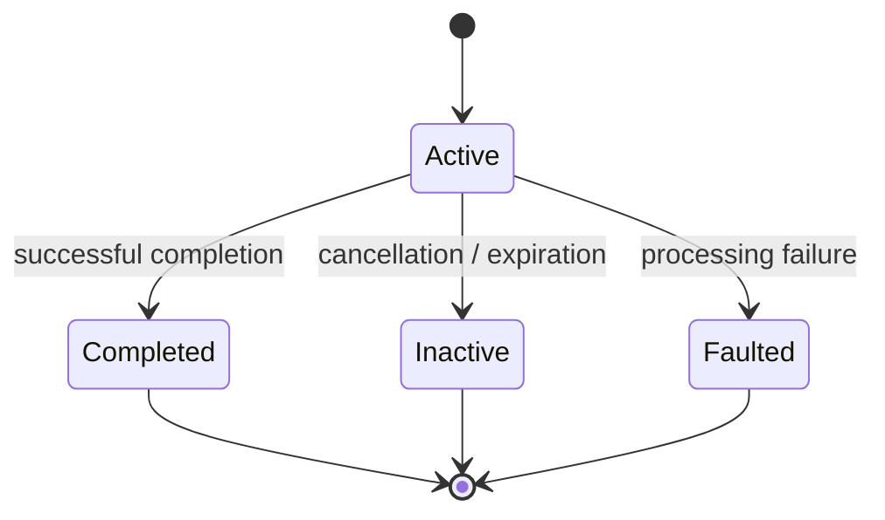
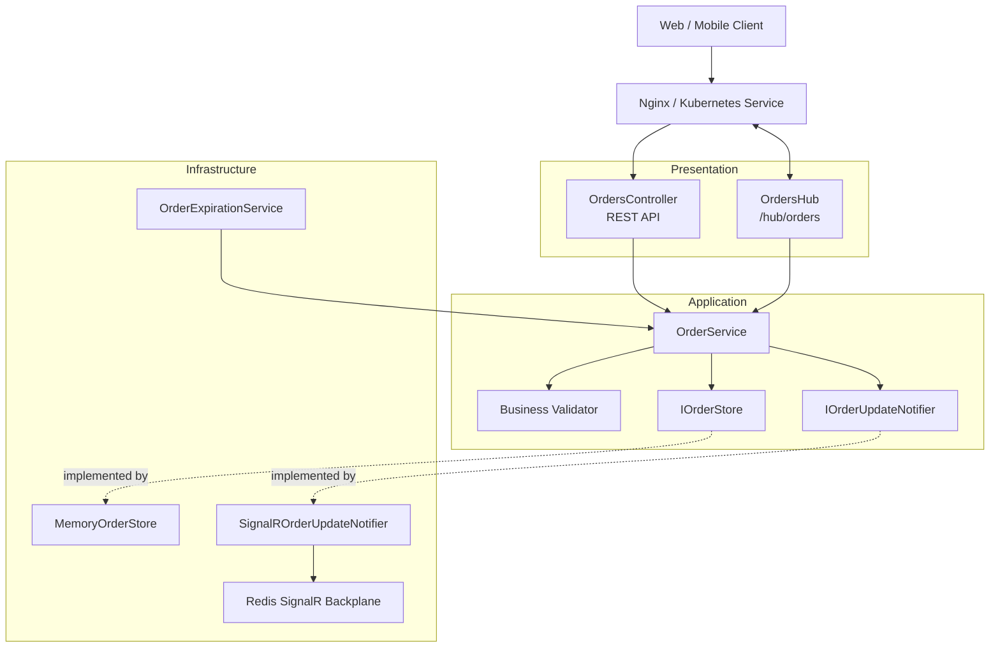
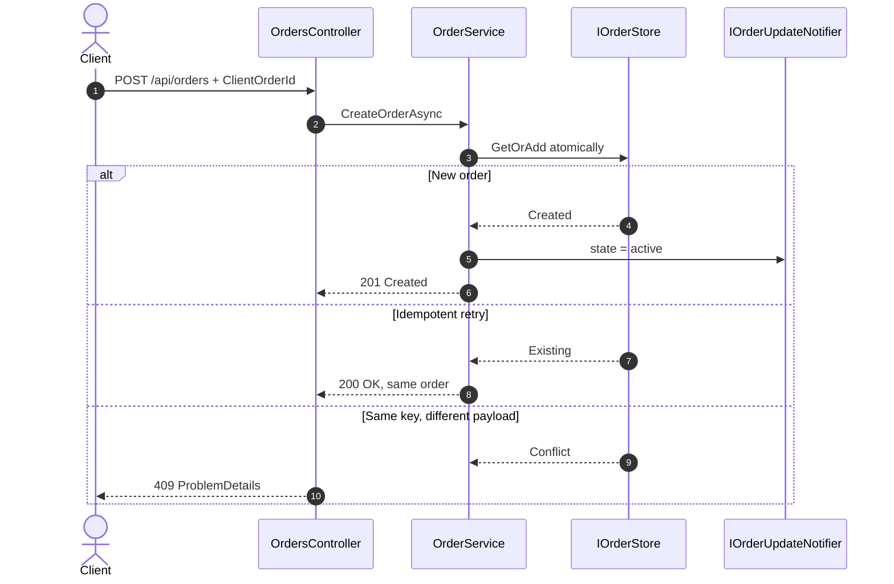

# Order Realtime API

[](https://github.com/alexKuzovkov/order-realtime-api/actions/workflows/ci.yml)
[](https://dotnet.microsoft.com/)
[](https://learn.microsoft.com/aspnet/core/signalr/)
[](https://redis.io/)

**Real-time .NET 9 backend demonstrating SignalR, Redis-backed horizontal scaling, idempotent order creation, explicit order-state transitions, background processing, and Kubernetes-oriented deployment.**

This project focuses on engineering concerns behind real-time APIs running on multiple application instances: connection routing, cross-instance SignalR delivery, request idempotency, concurrent state transitions, background expiration, health checks, and production scaling trade-offs.

> The current implementation intentionally uses an in-memory order store. Redis is used as the SignalR backplane, not as distributed business-state storage. A persistent production implementation would replace `IOrderStore` with a database or distributed store.

## Highlights

- **.NET 9 / ASP.NET Core**
- **Typed SignalR Hub**
- **Redis SignalR backplane**
- **Two API instances behind Nginx** in Docker Compose
- **Explicit `OrderState` lifecycle** instead of a boolean status flag
- **Thread-safe state transitions** through `Interlocked.CompareExchange`
- **Idempotent order creation** using `ClientOrderId`
- **Background order expiration** with `BackgroundService`
- **Centralized Problem Details** error handling
- **Kubernetes Deployment + HPA**
- **GitHub Actions** build, unit tests, Docker validation, and full PowerShell E2E

## Order state model

The previous boolean `IsActive` flag has been replaced with an explicit state model:

```csharp
public enum OrderState
{
    Active = 1,
    Completed = 2,
    Inactive = 3,
    Faulted = 4
}
```

`Completed` and `Inactive` use standard English/.NET naming. New orders start in `Active`.



Terminal transitions are atomic: only the first transition from `Active` succeeds. A completed, inactive, or faulted order cannot transition again.

The current application flow uses `Inactive` for automatic expiration. `Completed` and `Faulted` are domain-supported terminal states ready for future application workflows.

API and SignalR payloads serialize the enum as readable camel-case strings:

```json
{
  "id": "...",
  "clientOrderId": "...",
  "symbol": "AAPL",
  "price": 225.50,
  "volume": 10,
  "createdAt": "2026-08-15T10:00:00Z",
  "state": "active"
}
```

## Architecture



### Runtime topology

Docker Compose starts **two API instances**, Redis, and Nginx. For deterministic E2E checks with the intentionally process-local store, the two API instances are also exposed directly on ports `5001` and `5002`:

```text
                    ┌──────────────┐
Client ────────────►│    Nginx     │
                    └──────┬───────┘
                           │
                 ┌─────────┴─────────┐
                 │                   │
          ┌──────▼──────┐     ┌──────▼──────┐
          │   API #1    │     │   API #2    │
          │  SignalR    │     │  SignalR    │
          └──────┬──────┘     └──────┬──────┘
                 │                   │
                 └─────────┬─────────┘
                           │
                     ┌─────▼─────┐
                     │   Redis   │
                     │ Backplane │
                     └───────────┘
```

Redis propagates SignalR messages so clients connected to different API instances can receive user-scoped updates.

## Idempotent creation flow



The create response now uses a real `GET /api/orders/{orderId}` resource route via `CreatedAtAction`, and the same endpoint makes state changes observable to automated tests and API clients.

## Concurrency model

The in-memory store uses `ConcurrentDictionary` for order identity and lookup. The order itself owns its state transition:

```csharp
private bool TryTransitionFromActive(OrderState targetState) =>
    Interlocked.CompareExchange(
        ref _state,
        (int)targetState,
        (int)OrderState.Active) == (int)OrderState.Active;
```

This prevents duplicate terminal transitions when several background or application operations race on the same order.

## Horizontal scaling

The Redis backplane solves **real-time message distribution** between API instances. It does **not** make the in-memory order store distributed.

For production, `IOrderStore` should be replaced with PostgreSQL, SQL Server, Redis, or another durable distributed adapter with a unique constraint on `(UserId, ClientOrderId)`.

## Kubernetes

`deploy/k8s.yaml` demonstrates:

- Deployment with multiple replicas
- Service
- readiness and liveness probes
- CPU/memory requests and limits
- HPA up to 6 replicas
- 70% CPU target
- controlled scale-down stabilization
- Redis deployment and service

## Transactional Outbox — production evolution

The project intentionally does not pretend that an in-memory pseudo-outbox provides transactional guarantees.

A durable implementation would evolve the write path to:

```text
Order transaction
      │
      ├── Order
      └── OutboxMessage
              │
              ▼
           COMMIT
              │
              ▼
       Outbox Publisher
              │
              ▼
      SignalR / Broker
```

## Technology stack

| Area | Technology |
|---|---|
| Runtime | .NET 9, ASP.NET Core |
| Real-time | SignalR |
| Backplane | Redis 7.4 |
| Reverse proxy | Nginx |
| State | Concurrent in-memory store + `OrderState` |
| Error handling | Problem Details / `IExceptionHandler` |
| Containers | Docker, Docker Compose |
| Orchestration example | Kubernetes |
| Autoscaling | HPA |
| Testing | xUnit + PowerShell/Bash E2E |
| CI | GitHub Actions |

## Run locally

### Full Docker E2E on Windows / PowerShell 7

```powershell
.\test_all.ps1 -StartServices
```

### Full Docker E2E on Linux / macOS / WSL

```bash
./test_all.sh --start
```

### Start the development UI directly

```powershell
.\scripts\start-windows.ps1
```

or:

```bash
./scripts/start-wsl.sh
```

Open `http://localhost:8080` when using Docker Compose.

Direct instance endpoints used for deterministic in-memory E2E checks:

- `http://localhost:5001` → API instance 1
- `http://localhost:5002` → API instance 2

Because `MemoryOrderStore` is process-local, idempotency and lifecycle assertions deliberately target one direct instance. The Nginx/Redis topology is still started and health-checked in CI; cross-instance business-state guarantees require shared persistence.

## CI

GitHub Actions runs:

1. .NET 9 restore
2. Release build with warnings treated as errors
3. Unit tests
4. Docker Compose validation
5. `./test_all.ps1 -StartServices`
6. Container logs on E2E failure
7. Guaranteed Docker cleanup

The E2E suite validates direct-instance and gateway health, order creation, enum state serialization, resource lookup, user isolation, idempotency, conflicts, request validation, business rules, active-order filtering, and automatic `Active → Inactive` expiration. Functional state assertions target one API instance because the demo store is intentionally process-local.

## Production considerations

Before using this design as a production order system:

- replace `MemoryOrderStore` with durable shared persistence
- enforce idempotency with a database unique constraint
- persist Data Protection keys across instances
- replace demo authentication with JWT/OIDC
- add durable Transactional Outbox
- add external metrics/tracing backend
- use managed Redis / Redis HA
- add TLS and secret management
- add WebSocket load and soak tests

## Engineering focus

This repository is intentionally different from a CRUD demo. It highlights the interaction between:

**SignalR · WebSockets · Redis · Order State Machine · Concurrency · Idempotency · Background Processing · Horizontal Scaling · Kubernetes**
